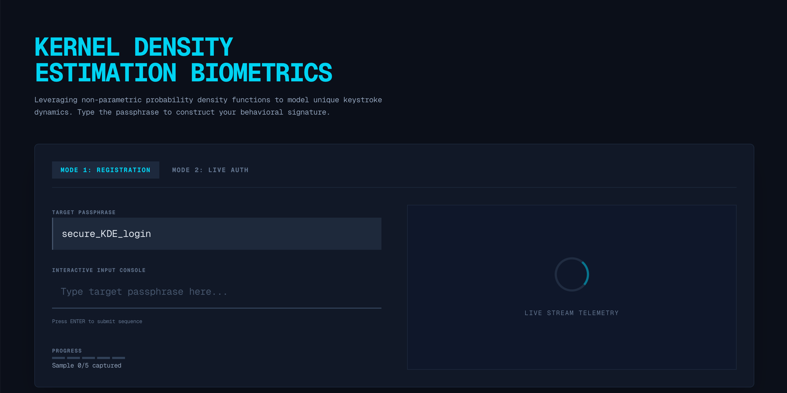
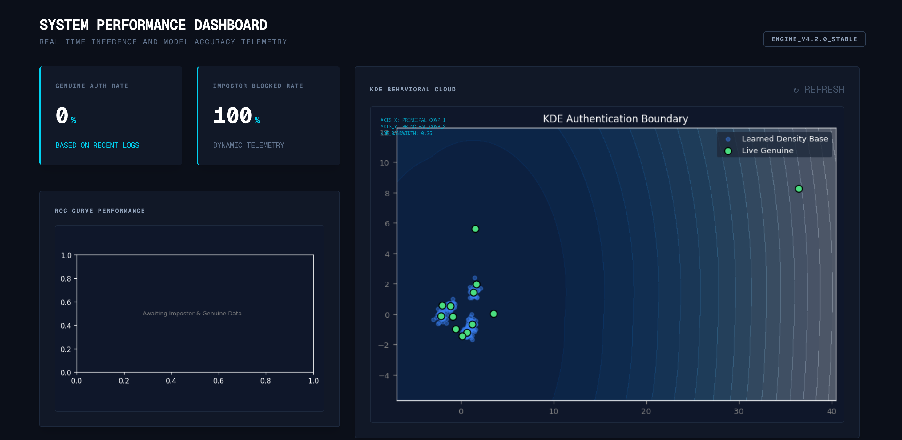

# Keystroke Dynamics Biometric Authenticator

A real-time, behavioral biometric authentication system that verifies user identity based on *how* they type, rather than just *what* they type. This project leverages non-parametric machine learning (Kernel Density Estimation) to model unique typing rhythms and continuously adapts to human behavioral drift over time.





## 🧠 Core Features

* **Zero-Trust Continuous Authentication:** Analyzes Keystroke Dynamics (Dwell time, Flight time, Hold time) down to the millisecond.
* **Cold-Start Mitigation:** Uses Multi-Modal Synthetic Data Generation to build a robust, secure baseline from just 5 initial registration samples by injecting realistic human micro-variations (jitter).
* **Adaptive Sliding Window (Concept Drift):** Employs asynchronous background tasks to continuously retrain the Scikit-Learn pipeline on the user's 100 most recent genuine logins, preventing lockouts as typing habits naturally evolve.
* **Live Telemetry Dashboard:** Dynamically generates and renders real-time Matplotlib charts (ROC Curves and KDE Contour Maps) via Base64 encoding to visualize authentication boundaries and model accuracy.

## 🏗️ Architecture & Tech Stack

This project is structured as a monorepo containing a decoupled frontend and backend.

* **Frontend (`/kde-authenticator`):** Next.js 14, React, TailwindCSS.
* **Backend (`/kde-backend`):** FastAPI, Scikit-Learn, Pandas, NumPy, Matplotlib.
* **Database & Storage:** Supabase (PostgreSQL for keystroke logs/metadata, Object Storage for serialized `.pkl` models).

### Mathematical Foundation
The system utilizes Principal Component Analysis (PCA) for dimensionality reduction of the highly correlated timing vectors. The reduced features are then fed into a Gaussian Kernel Density Estimator to construct a probability density function:

$\hat{f}_h(x) = \frac{1}{nh} \sum_{i=1}^n K\Big(\frac{x-x_i}{h}\Big)$

Authentications are scored based on log-likelihood. Boundaries are strictly enforced at dynamic percentiles (e.g., 5th percentile) of the user's localized density clusters.

---

## 🚀 Local Installation & Setup

### Prerequisites
* Node.js (v18+)
* Python (3.9+)
* A Supabase project with a `keystroke_logs` table, `model_metadata` table, and a `kde-models` storage bucket.

### 1. Setup the Backend (FastAPI)
Navigate to the backend directory and set up your Python environment:
```bash
cd kde-backend
python -m venv .venv
source .venv/bin/activate  # On Windows use: .venv\Scripts\activate
pip install -r requirements.txt
```

Create a `.env` file in the `kde-backend` directory and add your Supabase credentials:
```env
SUPABASE_URL=your_supabase_project_url
SUPABASE_KEY=your_supabase_anon_key
```

Start the FastAPI server:
```bash
uvicorn main:app --reload
```
*The API will run on `http://127.0.0.1:8000`*

### 2. Setup the Frontend (Next.js)
Open a new terminal window, navigate to the frontend directory, and install dependencies:
```bash
cd kde-authenticator
npm install
```

Start the Next.js development server:
```bash
npm run dev
```
*The web app will run on `http://localhost:3000`*

---

## 🎯 How to Demo the System

To get the best results during a live demonstration or evaluation, follow these golden rules:

1. **Register Naturally:** In Mode 1 (Registration), type the target passphrase 5 times at your normal, relaxed cadence. Do not speed-run it. 
2. **The Backspace Penalty:** The system tracks precise keydown/keyup events. If you make a typo during the demo, **do not use the Backspace key**. Highlight the text to delete it, or refresh the page. Using backspace records anomalous flight times and will correctly flag you as an impostor.
3. **Trigger the Sliding Window:** Tell the system you are a "Genuine User" and successfully log in. Check the backend terminal to watch the `[BACKGROUND TASK]` silently retrain your threshold. 
4. **Observe the Dashboard:** Click `REFRESH` on the Performance Dashboard to watch your historical KDE cloud map dynamically shift its shape around your newest data points.

---

## 📁 Repository Structure
```text
ANOMALY_DETECTOR/
├── kde-authenticator/      # Next.js Frontend
│   ├── app/                # Main application routing and state orchestration
│   ├── components/         # Modular UI (InteractiveConsole, PerformanceDashboard)
│   └── hooks/              # Custom React hooks (useKeystrokes.ts)
│
├── kde-backend/            # Python FastAPI Backend
│   ├── main.py             # Core API routing, model training, and plotting logic
│   ├── requirements.txt    # Python dependencies
│   └── .env                # (Ignored) Environment variables
│
└── .gitignore              # Monorepo git ignore rules
```