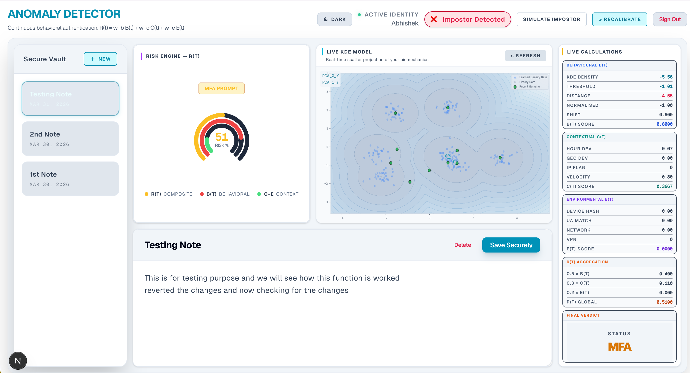

# Anomaly Detector: Continuous Biometric Authentication & Risk Engine

A state-of-the-art, zero-trust authentication platform that replaces static credentials with **continuous behavioral signatures**. This project, developed for a dissertation demonstration, leverages non-parametric machine learning and multi-factor risk aggregation to verify user identity in real-time.

---




## 🚀 Live Demonstration

Experience the "Secure Vault" and biometric profiling live:

*   **Frontend UI (Next.js):** [https://kde-authenticator.vercel.app](https://kde-authenticator.vercel.app)
*   **Backend API (FastAPI):** [https://anomaly-detector-x35v.onrender.com/](https://anomaly-detector-x35v.onrender.com/)

---

## 🧠 The Science: Continuous Biometrics

Traditional authentication happens once at the "front door." Anomaly Detector monitors identity **throughout the entire session** by analyzing *how* a user interacts with the system.

### 1. Keystroke Dynamics — The "Behavioral Signature" $B(t)$
The system captures timing data at millisecond precision:
*   **Dwell Time:** Duration a key is held down.
*   **Flight Time:** Time interval between releasing one key and pressing the next.
*   **Hold Time:** Total duration from press to release for specific sequences.

### 2. High-Dimensional Modeling (KDE + PCA)
Since raw timing data is highly correlated and high-dimensional, the system uses:
*   **PCA (Principal Component Analysis):** To reduce 6-dimensional feature vectors into a projectable 2D space.
*   **KDE (Kernel Density Estimation):** To build a non-parametric probability density function of the user's "genuine" typing rhythm.

### 3. The Multi-Factor Risk Engine $R(t)$
The final authentication decision is an aggregate of three core risk vectors:
$$R(t) = w_b B(t) + w_c C(t) + w_e E(t)$$

| Vector | Name | Description | Weight |
| :--- | :--- | :--- | :--- |
| **$B(t)$** | **Behavioral** | KDE log-likelihood distance from biometric baseline. | 50% |
| **$C(t)$** | **Contextual** | IP history, Time-of-day consistency, and Login Velocity. | 30% |
| **$E(t)$** | **Environmental** | Device fingerprint, User-Agent, and VPN/Proxy detection. | 20% |

---

## 🛠️ Tech Stack & Architecture

### Frontend: Next.js 15 + React
*   **Real-time Capture:** Custom hooks for low-level DOM event listeners.
*   **Visualizations:** D3-inspired SVG gauges and dynamic KDE plot rendering.
*   **State Management:** React Context for theme (Light/Dark) and Identity orchestration.
*   **Styling:** Modern, high-contrast TailwindCSS with full semantic token support.

### Backend: FastAPI + Scikit-Learn
*   **Processing:** Feature extraction and vectorization in Python.
*   **ML Pipeline:** PCA transformation and KDE scoring via Scikit-Learn.
*   **Plotting:** Dynamic Matplotlib generation returned as Base64 URI.
*   **Asynchronous Tasks:** Background retraining via a sliding window of recent genuine samples.

### Infrastructure: Supabase
*   **Database:** PostgreSQL for logs, user metadata, and contextual events.
*   **Storage:** Secure S3-compatible buckets for serialized ML models (`.pkl`).

---

## 📁 Repository Structure

```text
ANOMALY_DETECTOR/
├── kde-authenticator/      # Next.js Application
│   ├── app/                # Root Layout & Identity Orchestration
│   ├── components/         # Dashboard UI (RiskGauge, PerformanceDashboard, NoteEditor)
│   ├── contexts/           # Theme and Auth state providers
│   └── hooks/              # Biometric capture (useKeystrokes, useDeviceFingerprint)
│
├── kde-backend/            # Python FastAPI Service
│   ├── api/                # REST endpoints (auth, registration, metrics)
│   ├── services/           # ML logic, Risk Engine, and Plotting
│   ├── core/               # Supabase & Environment configuration
│   └── schemas/            # Pydantic data models
│
└── README.md               # You are here
```

---

## 🚦 Local Setup

### 1. Prerequisites
*   Node.js (v18+) & Python (v3.10+)
*   Supabase Account (Free Tier sufficient)

### 2. Backend Installation
```bash
cd kde-backend
python -m venv venv
source venv/bin/activate  # Windows: venv\Scripts\activate
pip install -r requirements.txt
```
Create a `.env` with `SUPABASE_URL` and `SUPABASE_KEY`.
```bash
uvicorn main:app --reload
```

### 3. Frontend Installation
```bash
cd kde-authenticator
npm install
npm run dev
```

---

## 🎯 Demonstration Guide

1.  **Register:** Create a profile and type the passphrase exactly 5 times naturally.
2.  **Verify:** Enter the "Secure Vault" and start writing notes. Watch $B(t)$ adjust your Risk Gauge.
3.  **Impostor Test:** Use the "Simulate Impostor" toggle to see how the system reacts to mismatched behavioral patterns and contextual anomalies.
4.  **Observe Retraining:** Successful entries contribute to your "KDE Cloud," visible in the Live Performance Dashboard.

---

**Disclaimer:** This project is a dissertation prototype. While it demonstrates production-grade concepts, it is intended for educational and research purposes in behavioral biometrics.