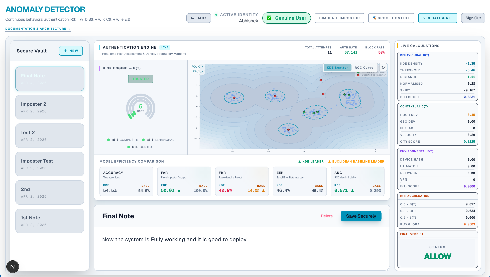
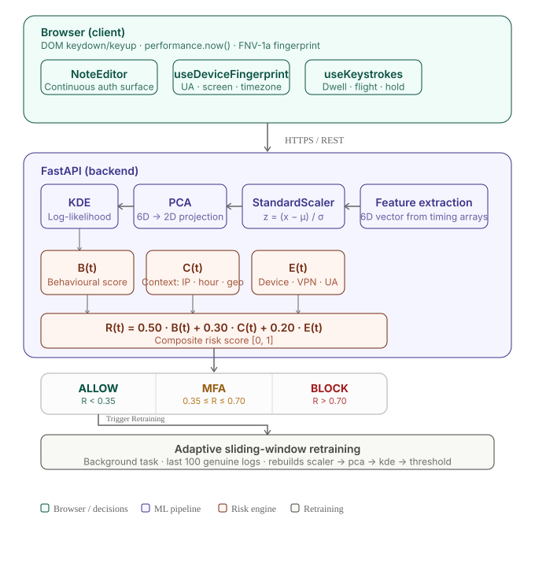

# Anomaly Detector: Continuous Biometric Authentication & Risk Engine

[](https://nextjs.org/)
[](https://fastapi.tiangolo.com/)
[](https://scikit-learn.org/)
[](https://supabase.com/)

A state-of-the-art, **Zero-Trust Behavioral Authentication** platform developed for a university dissertation. Anomaly Detector replaces static binary login gates with a **continuous biometric pulse**, verifying identity throughout the entire user session without friction.

---

## 🖥️ System Dashboard


---

## 🧠 Core Methodology

Traditional authentication is a "gate" you pass once. Anomaly Detector is a **"heartbeat"** that monitors identity by analyzing the unique rhythmic cadence of your muscle memory.

### 1. The Behavioral Signature $B(t)$
The system captures sub-millisecond DOM events to extract a 6-dimensional feature vector:
- **Dwell Time:** Physical duration a key is held.
- **Flight Time:** Transition interval between keys.
- **Hold Time:** Cumulative duration of keystroke pairs.
- **Consistency ($ \sigma $):** Statistical variance capturing typing steadiness.

### 2. Gaussian Kernel Density Estimation (KDE)
The system builds a non-parametric probability density function of a user's "genuine" typing rhythm. 
$$f̂_h(x) = \frac{1}{nh} \sum_{i=1}^n K\left(\frac{x - x_i}{h}\right)$$
Unlike simple centroid models, KDE captures the multi-modal "cloud" of natural behavior, allowing for high precision without the rigid constraints of parametric distributions.

### 3. PCA-Driven Dimensionality Reduction
To enable real-time visualization and remove feature correlation (e.g., between Dwell and Hold times), a 6D $\rightarrow$ 2D **Principal Component Analysis** projection is applied before scoring.

### 4. Aggregated Risk Engine $R(t)$
The final authentication verdict is a weighted composite of three independent risk vectors:
$$R(t) = 0.50 \cdot B(t) + 0.30 \cdot C(t) + 0.20 \cdot E(t)$$

| Vector | Category | Attributes Monitored |
| :--- | :--- | :--- |
| **$B(t)$** | **Behavioral** | KDE Log-Likelihood, PCA Euclidean Distance. |
| **$C(t)$** | **Contextual** | Hour Consistency, Geolocation (IP-based), Login Velocity. |
| **$E(t)$** | **Environmental** | FNV-1a Device Fingerprint, VPN/Proxy usage, User-Agent. |

---

## 🏗️ System Architecture


---

## 🛡️ Academic Ethics & Privacy

This project is built with a **Zero-Knowledge Architecture** dedicated to participant privacy:
- **No Text Storage:** Raw keystroke content (the actual letters typed) is discarded in browser memory instantly after computing timing differentials.
- **Data Minimization:** Only numerical floats (e.g., `120.5ms`) cross the network.
- **Instant Erasure:** Deleting a profile wipes the PostgreSQL metadata, the Cloud S3 `.pkl` models, and all historical timing logs.

---

## 📁 Repository Structure

```text
ANOMALY_DETECTOR/
├── kde-authenticator/      # Next.js Frontend (Identity & Visualization)
│   ├── app/about/          # Full Technical Documentation & Math
│   ├── components/         # SVG Gauges, KDE Maps, ROC Curves
│   └── hooks/              # Precision Timing Capture (performance.now)
│
├── kde-backend/            # FastAPI ML Service
│   ├── api/                # REST Gateways
│   ├── services/           # Scikit-Learn Pipelines & Plotting
│   └── core/               # Supabase Integration & Security
│
└── README.md               # Overview & Setup Guide
```

---

## 🚦 Installation & Setup

### 1. Backend (FastAPI)
```bash
cd kde-backend
pip install -r requirements.txt
uvicorn main:app --reload
```
*Requires `.env` with `SUPABASE_URL` and `SUPABASE_KEY`.*

### 2. Frontend (Next.js 15)
```bash
cd kde-authenticator
npm install
npm run dev
```
*Navigate to `http://localhost:3000` to begin.*

---

## ✉️ Researcher Contact
**Abhishek Shekhawat**  
*Principal Investigator (Dissertation Project)*

- **Email:** [abhishek.shekhawat.1920@gmail.com](mailto:abhishek.shekhawat.1920@gmail.com)
- **LinkedIn:** [linkedin.com/in/abhishek-shekhawat/](https://www.linkedin.com/in/abhishek-shekhawat/)

---
**Disclaimer:** This is a dissertation prototype intended for research purposes. Developed with high-precision behavioral modeling to demonstrate modern zero-trust paradigms.